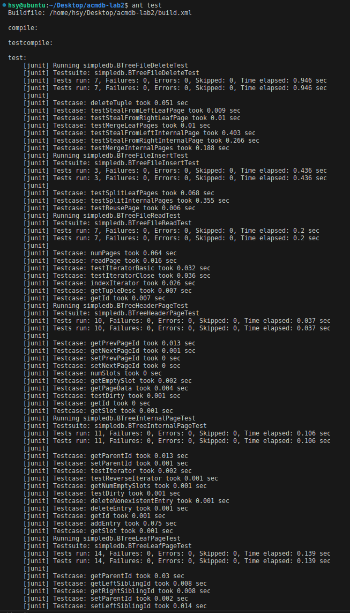
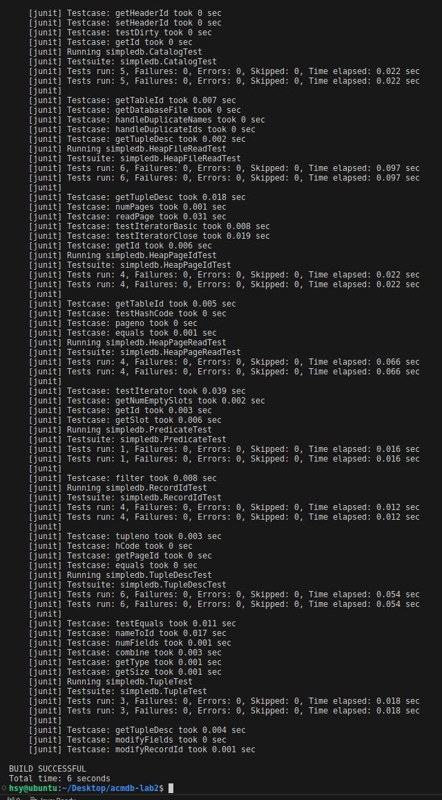
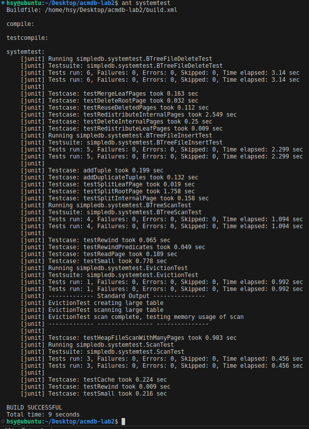

# WriteUp for Lab2    
## 521120910234 Shiyi Huang
## Design Decision 
#### Exercise1
To implemente the BufferPool, I select **Least Recently Used (LRU)** eviction strategy, which is a popular method for managing a finite number of cache pages. In this design, each page accessed, whether for reading or writing, is moved to the front of a doubly linked list to maintain recency. When the cache reaches its capacity and a new page needs to be inserted, the BufferPool evicts the least recently used page—identified as the one closest to the tail of the list that is not currently marked as dirty. This approach ensures that the most recently used pages remain in the cache longer, which can significantly improve the performance of database operations by reducing the number of disk reads and writes.

#### Exercise2
Function `findLeafPage` is designed to efficiently search a B+ tree for a specific key field, `f`, using a recursive approach. It navigates through the tree from the root to the appropriate leaf node, locking internal nodes in read-only mode and the target leaf node with specified permissions to ensure data integrity during concurrent accesses. If `f` is null, the function targets the left-most leaf, aiding in the implementation of iterators. This method effectively harnesses the structured navigation properties of B+ trees to quickly locate and access the necessary data, optimizing both range queries and sequential data traversal.

#### Exercise3
The `splitLeafPage` and `splitInternalPage` functions are designed to manage space in a B+ tree when inserting new elements causes overflow. `splitLeafPage` handles leaf overflows by splitting the full leaf into two, redistributing tuples, and updating sibling and parent pointers; it ensures the new tuple is inserted into the correct leaf by comparing the insertion key with the median key of the split. `splitInternalPage` addresses overflow in internal nodes similarly by redistributing entries, pushing the median key up to the parent, and recursively splitting higher levels if necessary. Both functions ensure the tree maintains its balanced structure and update necessary pointers to reflect changes, making them essential for maintaining the efficiency and integrity of B+ tree operations during insertions.

#### Exercise4
The functions `stealFromLeafPage`, `stealFromLeftInternalPage`, and `stealFromRightInternalPage` are designed to manage and maintain the balance of B+ tree structures by redistributing data between sibling nodes when one becomes less than half full. `stealFromLeafPage` shifts tuples between leaf pages and updates the parent's keys to ensure both siblings maintain minimum occupancy. Similarly, `stealFromLeftInternalPage` and `stealFromRightInternalPage` adjust the distribution of entries between internal pages, pulling down or pushing up keys to the parent to maintain a balanced tree structure, ensuring that internal nodes also meet occupancy requirements and maintain proper tree integrity. These mechanisms are crucial for the B+ tree's performance, especially under high update and delete operations, by preventing excessive page splits or merges.

#### Exercise5
The functions `mergeLeafPages` and `mergeInternalPages` are designed to consolidate data within a B+ tree by merging two neighboring nodes (leaf or internal) into one when one of them falls below the required minimum occupancy after deletions. The `mergeLeafPages` function transfers all tuples from a right leaf to a left leaf, updating sibling links and adjusting the parent's entries, while `mergeInternalPages` moves all entries from a right internal page to a left internal page, incorporating a key from the parent to maintain the tree structure, both methods also marking the emptied right page for reuse.

These functions, along with `stealFromLeafPage`, `stealFromLeftInternalPage`, and `stealFromRightInternalPage`, collectively support the deletion operations in a B+ tree by managing the redistribution and consolidation of nodes to maintain balance and occupancy rules. During deletion, if a node falls below half occupancy, the tree first tries to redistribute entries or tuples from adjacent siblings; if this is not sufficient to achieve balance, it then merges nodes. These mechanisms ensure the B+ tree remains balanced and efficient, preserving its optimal path lengths and search times even after multiple deletions.


## Change Made to API
The main changes to the API involve the additional definition of three classes: ```ResourceLock``` for locking, ```LockController``` for lock control, and ```DoublyLinkedNode``` for doubly linked list support, to facilitate the LRU strategy.

## Conclusion
I have completed all the requirements for this experiment, which took me approximately 15 hours. The difficulty mainly lied in understanding B+ trees and implementing their search/delete algorithms into Java code, which posed quite a challenge. Finally, providing screenshots of passing all the test cases was the last step.





